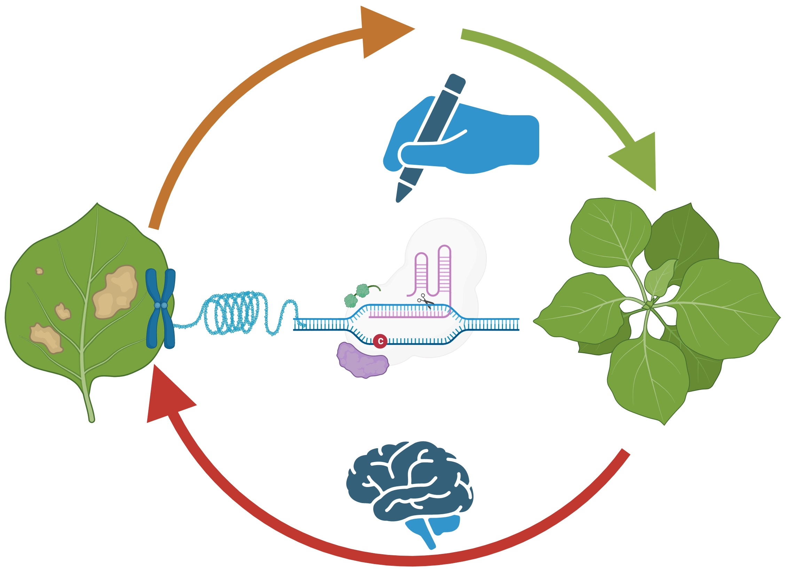

# My Scientific goal

"Food is the moral right of all who are born into this world: Norman Borlaug"

Plants are challenged by myriads of environmental factors that limit their productivity.
Genome editing is one of the robust tool to manipulate their genome but is uncontrolled and imprecise.
In order to engineer plants with precision, a rational approach is needed to improve the existing molecular platform.

I am a "Plant Molecular Biologist" by training and my ultimate long term goal is to create smart crops 
for a sustainable agriculture. To accomplish this, I am currently working on a technology to improve 
precise genome editing for crop improvement at University of Minnesota-Twin Cities, USA. We are investigation factors that could improve targeted insertion and prime editing in model plant and crops.

###

## Education
                
  Postdoctoral Associate, University of Minnesota, Twin Cities, USA 2020- current 

  Research Associate, Center of Innovative and Applied Bioprocessing, India 

  PhD, National Agri-Food Biotechnology Institute & Panjab University India, India

##
© 2022-2023 Jitesh Kumar

### 

