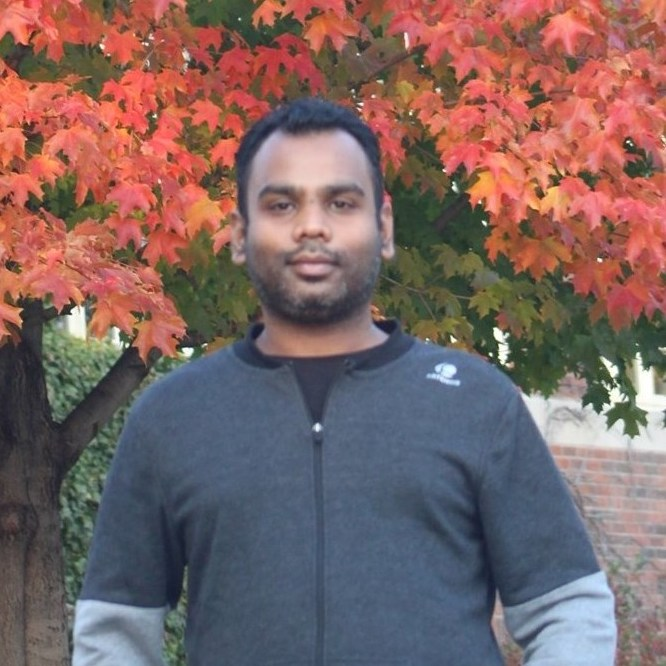

# **About Jitesh**

Jitesh is a Plant Molecular Biologist by training and interested in creating smart crops 
for sustainable agriculture. He is currently working on a technology for improving 
precise genome editing for crop improvement at University of Minnesota-Twin Cities, USA

## Academic affiliations

1. Post-Doctoral Associate, University of Minnesota-Twin Cities, USA. [https://experts.umn.edu/en/persons/jitesh-kumar](https://experts.umn.edu/en/persons/jitesh-kumar)

2. Research Associate, Center of Innovative and Applied Bioprocessing, India 

3. PhD, National Agri-Food Biotechnology Institute & Panjab University, India

###                  [Editing genome with the precision](https://twitter.com/kumar2501)

